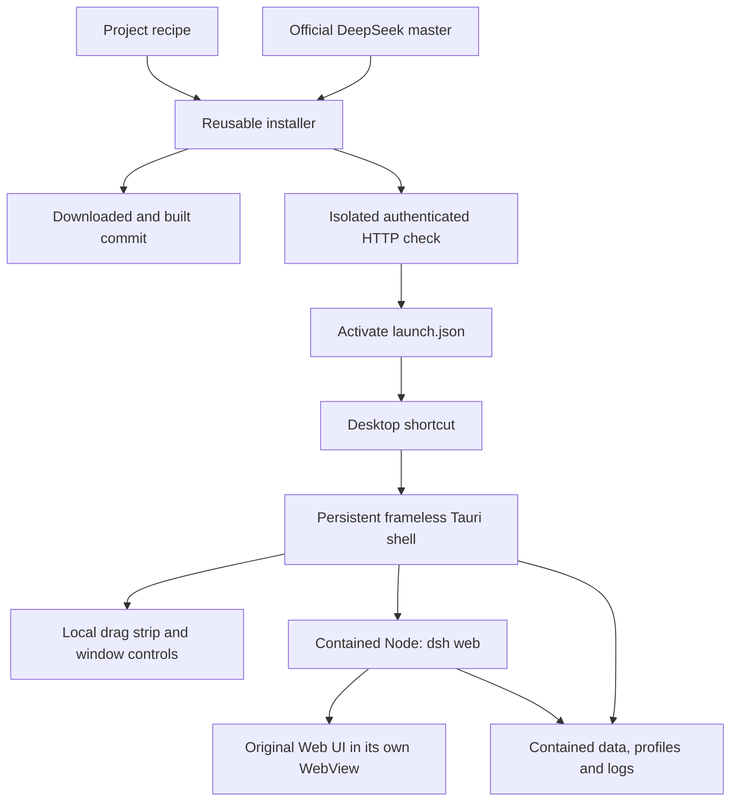
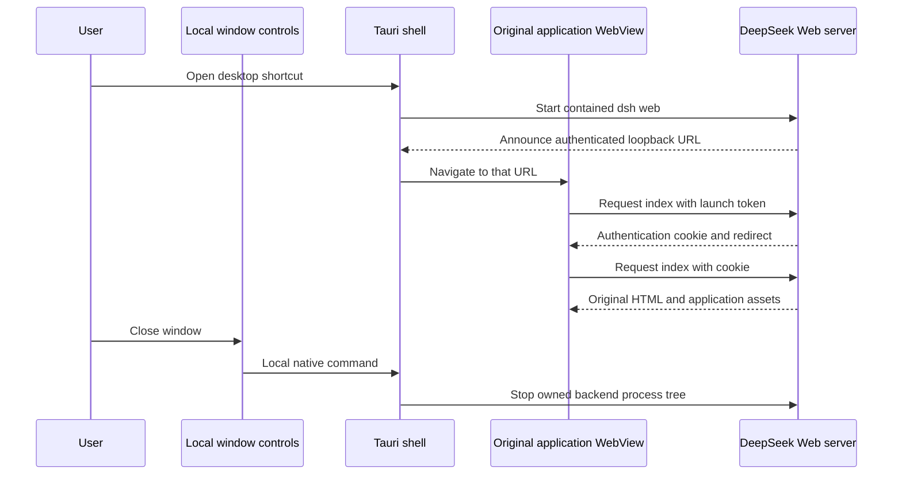
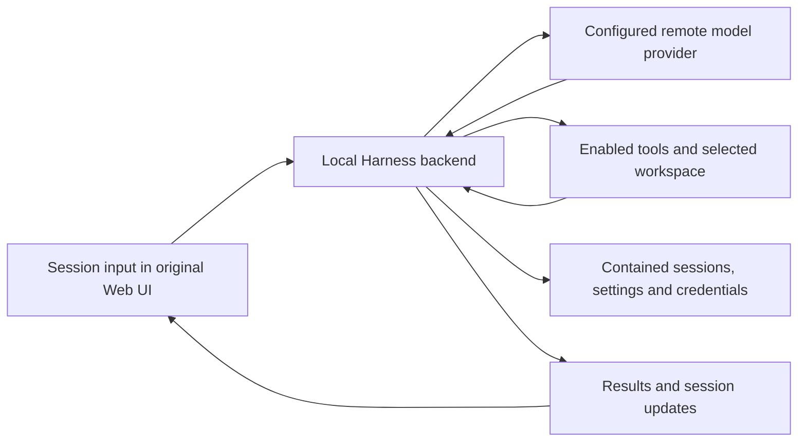

# Reusable desktop wrapper

English | [中文](README.zh.md)

## Summary

This standalone folder installs the official DeepSeek Harness source and opens its original Web UI in a frameless Tauri/Rust window. The same launcher executable survives application updates. Project recipes select the upstream repository, branch, build commands, and readiness announcement. Application sources are downloaded into a separate installation; the installer does not patch their UI or runtime code.

## Table of Contents

- [Install and run](#install-and-run)
- [Update and move](#update-and-move)
- [Project recipes](#project-recipes)
- [Files and requirements](#files-and-requirements)
- [Startup and shutdown](#startup-and-shutdown)
- [Verification and recovery](#verification-and-recovery)
- [Build and distribution](#build-and-distribution)
- [Dev Note](#dev-note)

<a id="install-and-run"></a>

## Install and run

Use the compiled Windows bundle, which includes `bin/portable-web-shell.exe`, or build that executable from this source folder using [Build-Shell.ps1](Build-Shell.ps1). The bundle can live independently of this repository checkout.

| File | Action |
| --- | --- |
| [Install.cmd](Install.cmd) | Download a contained Node runtime, resolve the upstream branch to a commit, download its source archive, install dependencies, build, verify the Web UI, activate the revision, and create a desktop shortcut. |
| [Run.cmd](Run.cmd) | Launch the installed application in the frameless window. |
| [Update.cmd](Update.cmd) | Prepare and verify the current upstream revision using the same installer. |
| [Repair-Shortcut.cmd](Repair-Shortcut.cmd) | Recreate the desktop shortcut for this installation's current path. |

The default recipe is [projects/deepseek.json](projects/deepseek.json), pointing to `deepseek-ai/deepseek-harness` and its `master` branch. The default installation folder is `installed/deepseek` beside these scripts. Downloading a newer revision does not require merging a fork or recreating wrapper source.

The [Manage.ps1](Manage.ps1) `Plan` action displays the selected recipe and destination without installing anything. Its `InstallRoot` parameter selects another destination, `Ref` selects an upstream branch/tag/commit, and `NoShortcut` suppresses shortcut creation. The command files forward these parameters to the script.

<a id="update-and-move"></a>

## Update and move

Updates download each source revision into `app/versions/<commit>`, build it, and test its authenticated Web entry using a separate verification home. `launch.json` is replaced only after that test succeeds. Earlier revisions remain in the folder; they are not automatically deleted or selected as a downgrade. DeepSeek's persisted data has its own compatibility rules, so retaining an older build does not establish that it can read newer sessions.

Close the application before updating. An installation lock rejects simultaneous installers. The recorded upstream commit and runtime versions are in `installed.json`.

Close the application and move the installer bundle and its `installed` folder together. After changing the installation path or machine, run `Install.cmd` again: pnpm dependencies can contain Windows junctions that need relinking, and the shortcut contains an absolute destination. The installer retains application data, moves the previous generated dependency directory into `data/dependency-backups` when the recorded root changed, rebuilds dependencies and verifies the app, and recreates the shortcut. Shortcut repair alone does not reinstall dependencies. Paths to workspaces outside the installation may need to be selected again on another computer.

<a id="project-recipes"></a>

## Project recipes

The shell reads an installation's `launch.json`; it is independent of the DeepSeek repository and can launch another contained native executable. The current installer adapter supports GitHub source archives with a root `package.json` declaring an exact pnpm version. Other build systems require an installer adapter rather than pretending that a pnpm recipe applies to them.

| Recipe field | Meaning |
| --- | --- |
| `schemaVersion` | Supported recipe version, currently `1`. |
| `id`, `name` | Installation subfolder identifier and displayed application/shortcut name. |
| `shortcutName` | Optional desktop shortcut name; defaults to `name`. DeepSeek uses `DeepSeek Harness (Frameless)`. |
| `repository`, `ref` | GitHub repository and upstream reference to resolve. |
| `nodeMajor` | Portable Windows x64 Node release line. |
| `buildTools` | Whether this project's build needs Microsoft C++ tools; when absent, the installer offers installation or the official download. |
| `installCommands` | Arrays of arguments passed to the contained pnpm executable. Each command must succeed. |
| `launchArguments` | Arguments forwarded through pnpm when the shell starts the application. |
| `readinessPrefix` | Prefix of the newline-terminated stdout record containing the app's loopback HTTP URL. |
| `requireToken` | Require DeepSeek's root URL with exactly one nonempty `token` query parameter. |

The DeepSeek recipe runs its supported `dsh web` profile with `--no-open` and port `0`, allowing Windows to allocate a free port. The actual URL comes from DeepSeek's own announcement. A recipe for another application must match that application's real install and startup behavior.

<a id="files-and-requirements"></a>

## Files and requirements

```text
portable-desktop/
  Install.cmd / Update.cmd / Run.cmd / Repair-Shortcut.cmd
  Manage.ps1
  projects/deepseek.json
  bin/portable-web-shell.exe
  installed/deepseek/
    bin/portable-web-shell.exe
    runtime/node/                    contained Node and npm
    runtime/pnpm-<version>/          contained package manager
    app/versions/<commit>/          original source and generated build files
    launch.json                     active relative-path launch configuration
    installed.json                  upstream commit and runtime version record
    data/
      dsh-home/                     DeepSeek profiles, credentials, sessions and settings
      agents-home/                  DeepSeek agent files
      logs/                         installer and backend diagnostics
      webview-chrome/                shell WebView profile
      webview-app/                   application WebView profile
      npm-cache/ and pnpm-store/     package caches
      temp/                         downloaded archives and temporary files
      verification/                 isolated home used before activation
```

Installed users do not need Rust or Visual Studio to run a prebuilt shell. Windows PowerShell 5.1 or later and network access are required for installation. Node and pnpm are downloaded into the folder. Installation and launch also redirect the process home, AppData, Electron cache, and browser download caches into it. Node's ZIP is checked against the official release checksum. DeepSeek source is fetched by the exact commit returned by GitHub.

Microsoft WebView2 is a Windows runtime prerequisite. If it is missing, the installer downloads and runs Microsoft's bootstrapper. Its shared runtime belongs to Windows; application WebView profiles and caches belong to the installation's `data` folder. A source build of the shell requires Rust and Microsoft C++ Build Tools; [Build-Shell.ps1](Build-Shell.ps1) offers their installation or official download when missing.

The desktop shortcut is necessarily outside the folder. Dependencies required by later DeepSeek tools or plugins may have additional system requirements. User-selected workspaces can also live outside this installation. Runtime data, credentials and downloaded builds are ignored by Git.

Opening the Web UI does not require a model API request. To run an agent session, configure the selected model provider's account or API credential through DeepSeek's own configuration UI, and provide network access to that provider. The default local credential store writes beneath `DSH_HOME`, here `data/dsh-home`; credential configuration is separate from the temporary loopback launch token. The wrapper does not supply a model key or install a local language model. Tools enabled in DeepSeek may also need their own programs, credentials, and workspace permissions.

<a id="startup-and-shutdown"></a>

## Startup and shutdown



The window has a local title strip with drag, minimize, maximize/restore, and close controls. The app loads in a separate child WebView. No titlebar HTML, JavaScript, or CSS is inserted into DeepSeek's document. Only the local chrome can invoke native window actions; the application view receives no Tauri permissions. Each installation has its own single-instance identifier.



The Windows backend is spawned suspended, assigned to an owned Windows Job, and resumed after assignment. Closing or exiting the shell releases that Job and terminates its backend tree. This is forced termination, not DeepSeek's graceful shutdown protocol. Startup timeouts and process exits also stop the owned backend. Backend failure after readiness is reported in the title strip.

The shell accepts loopback HTTP readiness URLs, rejects foreign origins and malformed token URLs, and opens external HTTP(S) citations or authorization links through Windows' URL handler. Launch URL queries are redacted in the captured stdout log. Ambient environment variables whose names contain KEY, SECRET, TOKEN or PASSWORD are removed from the backend environment; configure DeepSeek credentials through its original UI and contained Harness home.



The shell manages the window and backend lifetime. DeepSeek owns session execution, provider requests, tool selection and persistence. The Web UI submits user actions to that local backend and displays its results; the model provider connection originates from Harness. Downloading an upstream revision updates those application components together, while the wrapper remains a separate executable.

<a id="verification-and-recovery"></a>

## Verification and recovery

The installer uses the shell's `--smoke` mode to launch the real backend, exchange its token for a cookie, request the HTML Web UI, and stop the backend. Installation failures leave the previous active `launch.json` in place. This checks startup and the authenticated index, not every DeepSeek feature or API provider.

[Test-Wrapper.ps1](Test-Wrapper.ps1) exercises the compiled shell using real HTTP and descendant Node processes. It covers fragmented stdout readiness, authenticated redirects, unauthorized responses, startup timeout, parent exit, descendant cleanup and launch-token log redaction. Rust tests cover readiness URL and owned-path validation.

[Test-Install.ps1](Test-Install.ps1) checks long-path extraction, rejection of unsafe ZIP entries, diagnostic capture, and native exit codes under Windows PowerShell. [Test-Window.ps1](Test-Window.ps1) checks original page rendering and native window controls on an interactive Windows desktop.

If installation or startup fails, inspect the newest file in `installed/deepseek/data/logs`. Installer scripts stop on nonzero command exit codes. A startup error also appears in the title strip; invalid launch files produce a native error dialog. Retry installation after correcting the reported problem. The `Verify` action runs the active configuration's HTTP check without opening the GUI.

<a id="build-and-distribution"></a>

## Build and distribution

The [portable desktop workflow](https://github.com/walladanger/deepseek-harness/actions/workflows/portable-desktop.yml) builds the reusable executable on Windows, runs Rust and executable behavior checks, and publishes a ZIP artifact containing the executable, scripts, recipes, licenses, and README. It does not install DeepSeek in CI or publish an app release automatically.

The bundle deliberately excludes installed applications, logs, credentials, dependency caches and Rust build output. The shell is built once for distribution; each user installation then downloads its upstream app. Update the shell separately when its own implementation changes.

[Package.ps1](Package.ps1) creates that curated ZIP locally. The wrapper executable is unsigned; the workflow does not use a signing certificate. The wrapper is a separate artifact from DeepSeek's signed official desktop client.

<a id="dev-note"></a>

## Dev Note

This installer and shell are outside DeepSeek's pnpm workspace. They launch the existing `dsh` profile and introduce no Harness package, plugin, model-visible event, or session-format change. Their HTTP and Windows lifecycle evidence is owned here rather than by a recorded Harness conversation.
