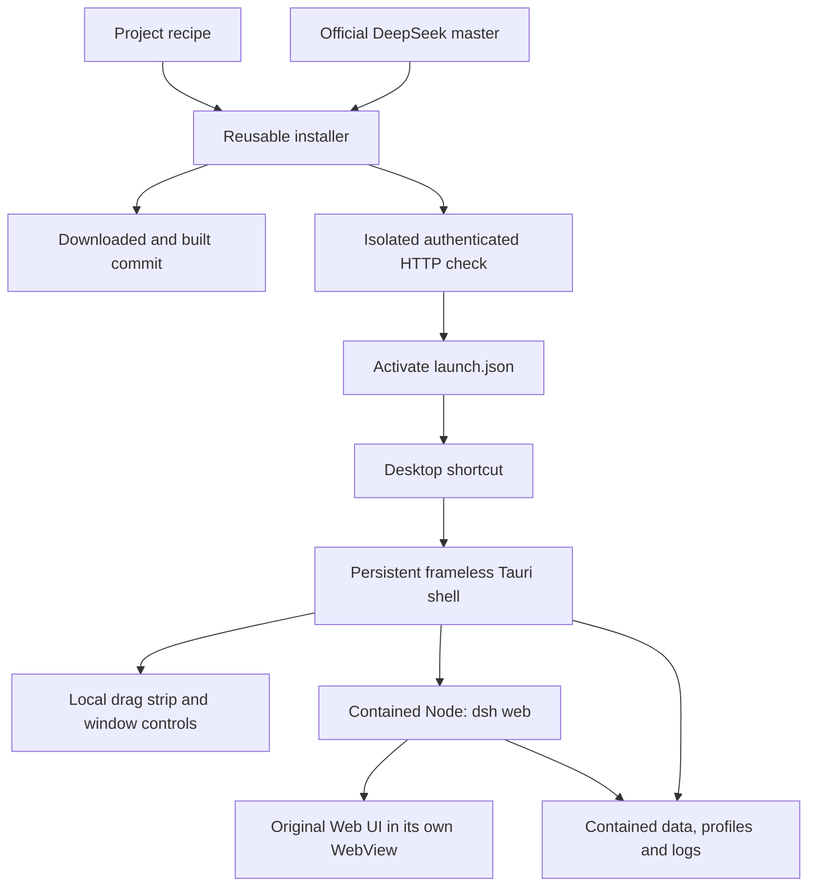
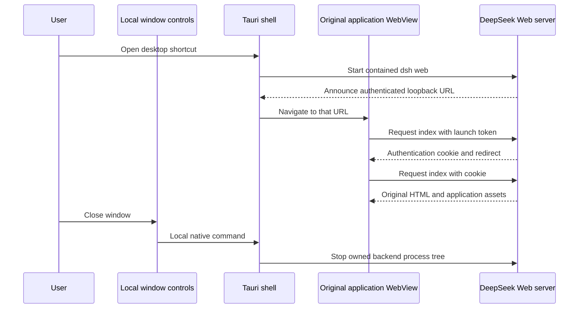

# 可复用桌面封装

[English](README.md) | 中文

## 概要

这个独立文件夹安装官方 DeepSeek Harness 源码，并在无边框 Tauri/Rust 窗口中打开其原始 Web UI。应用更新后仍使用同一个启动器可执行文件。项目配置选择上游仓库、分支、构建命令和就绪通知。应用源码下载到独立的安装目录；安装程序不修改其 UI 或运行时代码。

## 目录

- [安装和运行](#install-and-run)
- [更新和移动](#update-and-move)
- [项目配置](#project-recipes)
- [文件和要求](#files-and-requirements)
- [启动和关闭](#startup-and-shutdown)
- [验证和恢复](#verification-and-recovery)
- [构建和分发](#build-and-distribution)
- [开发说明](#dev-note)

<a id="install-and-run"></a>

## 安装和运行

使用包含 `bin/portable-web-shell.exe` 的已编译 Windows 分发包，或通过 [Build-Shell.ps1](Build-Shell.ps1) 从此源码目录构建可执行文件。分发包可独立于此仓库检出目录存放。

| 文件 | 操作 |
| --- | --- |
| [Install.cmd](Install.cmd) | 下载目录内的 Node 运行时，将上游分支解析到提交，下载源码归档，安装依赖，构建并验证 Web UI，启用该版本，创建桌面快捷方式。 |
| [Run.cmd](Run.cmd) | 在无边框窗口中启动已安装的应用。 |
| [Update.cmd](Update.cmd) | 使用同一安装程序准备并验证当前上游版本。 |
| [Repair-Shortcut.cmd](Repair-Shortcut.cmd) | 根据此安装目录的当前路径重新创建桌面快捷方式。 |

默认配置是 [projects/deepseek.json](projects/deepseek.json)，指向 `deepseek-ai/deepseek-harness` 的 `master` 分支。默认安装目录是这些脚本旁的 `installed/deepseek`。下载新版本不需要合并 fork，也不需要重新创建封装源码。

[Manage.ps1](Manage.ps1) 的 `Plan` 操作显示所选配置和目标目录，不安装任何内容。`InstallRoot` 参数选择其他目标目录，`Ref` 选择上游分支、标签或提交，`NoShortcut` 跳过创建快捷方式。命令文件将这些参数传递给脚本。

<a id="update-and-move"></a>

## 更新和移动

更新将每个源码版本下载到 `app/versions/<commit>`，构建后使用独立的验证主目录测试其需要认证的 Web 入口。仅在测试成功后替换 `launch.json`。旧版本保留在目录中，不自动删除或选作降级版本。DeepSeek 持久化数据有自己的兼容性规则，因此保留旧构建不代表它能读取新会话。

更新前关闭应用。安装锁拒绝同时运行的安装程序。记录的上游提交和运行时版本位于 `installed.json`。

关闭应用后，将安装分发包及其 `installed` 目录一并移动。更换安装路径或计算机后，重新运行 `Install.cmd`：pnpm 依赖可能包含需要重新链接的 Windows 联接点，快捷方式也使用绝对路径。安装程序保留应用数据，在记录的根目录变化时将原有的生成依赖目录移至 `data/dependency-backups`，重新构建依赖并验证应用，然后重新创建快捷方式。仅修复快捷方式不会重新安装依赖。安装目录之外的工作区路径可能需要在另一台计算机上重新选择。

<a id="project-recipes"></a>

## 项目配置

外壳读取安装目录的 `launch.json`，独立于 DeepSeek 仓库，可启动目录内的其他本机可执行文件。当前安装适配器支持 GitHub 源码归档，且根 `package.json` 必须声明确切的 pnpm 版本。其他构建系统需要相应的安装适配器，不能直接套用 pnpm 配置。

| 配置字段 | 含义 |
| --- | --- |
| `schemaVersion` | 支持的配置版本，目前为 `1`。 |
| `id`, `name` | 安装子目录标识以及显示的应用和快捷方式名称。 |
| `shortcutName` | 可选的桌面快捷方式名称，默认为 `name`。DeepSeek 使用 `DeepSeek Harness (Frameless)`。 |
| `repository`, `ref` | 要解析的 GitHub 仓库和上游引用。 |
| `nodeMajor` | 便携式 Windows x64 Node 的发布系列。 |
| `buildTools` | 此项目的构建是否需要 Microsoft C++ 工具；工具缺失时，安装程序提供安装选项或官方下载入口。 |
| `installCommands` | 传递给目录内 pnpm 可执行文件的参数数组。每条命令必须成功。 |
| `launchArguments` | 外壳启动应用时通过 pnpm 传递的参数。 |
| `readinessPrefix` | 包含应用环回 HTTP URL 的 stdout 行的前缀；该行必须以换行符结束。 |
| `requireToken` | 要求 DeepSeek 根 URL 带有且仅带有一个非空 `token` 查询参数。 |

DeepSeek 配置使用受支持的 `dsh web` profile，并指定 `--no-open` 和端口 `0`，让 Windows 分配空闲端口。实际 URL 来自 DeepSeek 自己的通知。其他应用的配置必须符合其实际安装和启动行为。

<a id="files-and-requirements"></a>

## 文件和要求

```text
portable-desktop/
  Install.cmd / Update.cmd / Run.cmd / Repair-Shortcut.cmd
  Manage.ps1
  projects/deepseek.json
  bin/portable-web-shell.exe
  installed/deepseek/
    bin/portable-web-shell.exe
    runtime/node/                    contained Node and npm
    runtime/pnpm-<version>/          contained package manager
    app/versions/<commit>/          original source and generated build files
    launch.json                     active relative-path launch configuration
    installed.json                  upstream commit and runtime version record
    data/
      dsh-home/                     DeepSeek profiles, credentials, sessions and settings
      agents-home/                  DeepSeek agent files
      logs/                         installer and backend diagnostics
      webview-chrome/                shell WebView profile
      webview-app/                   application WebView profile
      npm-cache/ and pnpm-store/     package caches
      temp/                         downloaded archives and temporary files
      verification/                 isolated home used before activation
```

已安装用户运行预编译外壳时不需要 Rust 或 Visual Studio。安装需要 Windows PowerShell 5.1 或更高版本以及网络连接。Node 和 pnpm 下载到该文件夹。安装和启动还将进程主目录、AppData、Electron 缓存和浏览器下载缓存重定向到其中。Node ZIP 根据官方发布校验和进行验证。DeepSeek 源码按 GitHub 返回的确切提交下载。

Microsoft WebView2 是 Windows 运行时前提。缺失时，安装程序下载并运行 Microsoft 引导安装程序。其共享运行时属于 Windows；应用 WebView 配置和缓存位于安装目录的 `data` 文件夹。源码构建外壳需要 Rust 和 Microsoft C++ Build Tools；[Build-Shell.ps1](Build-Shell.ps1) 在缺失时提供安装选项或官方下载入口。

桌面快捷方式必然位于文件夹之外。后续 DeepSeek 工具或插件所需的依赖可能还有额外系统要求。用户选择的工作区也可位于此安装目录之外。Git 忽略运行时数据、凭据和下载的构建。

<a id="startup-and-shutdown"></a>

## 启动和关闭



窗口使用本地标题条，提供拖动、最小化、最大化或还原以及关闭控件。应用在独立的子 WebView 中加载。不会向 DeepSeek 文档插入标题栏 HTML、JavaScript 或 CSS。只有本地窗口控件视图可调用本机窗口操作；应用视图没有 Tauri 权限。每个安装目录拥有独立的单实例标识。



Windows 后端以挂起状态启动，先加入外壳拥有的 Windows Job，再恢复执行。关闭或退出外壳时释放该 Job，终止整个后端进程树。这是强制终止，不是 DeepSeek 的正常关闭协议。启动超时和进程退出也会停止其拥有的后端。就绪后的后端失败会显示在标题条中。

外壳接受环回 HTTP 就绪 URL，拒绝外部来源和格式错误的令牌 URL，并通过 Windows URL 处理程序打开外部 HTTP(S) 引用或授权链接。捕获的 stdout 日志会隐藏启动 URL 查询参数。后端环境移除名称含 KEY、SECRET、TOKEN 或 PASSWORD 的继承环境变量；通过 DeepSeek 原始 UI 和目录内 Harness 主目录配置凭据。

<a id="verification-and-recovery"></a>

## 验证和恢复

安装程序使用外壳的 `--smoke` 模式启动真实后端，将其令牌交换为 cookie，请求 HTML Web UI，然后停止后端。安装失败保留先前启用的 `launch.json`。该检查验证启动和需要认证的首页，不涵盖每个 DeepSeek 功能或 API 提供方。

[Test-Wrapper.ps1](Test-Wrapper.ps1) 使用真实 HTTP 和 Node 后代进程测试已编译外壳。检查覆盖分段 stdout 就绪通知、认证重定向、未授权响应、启动超时、父进程退出、后代清理以及启动令牌日志隐藏。Rust 测试覆盖就绪 URL 和目录内路径验证。

[Test-Install.ps1](Test-Install.ps1) 在 Windows PowerShell 下检查长路径解压、不安全 ZIP 条目拒绝、诊断捕获和本机退出码。[Test-Window.ps1](Test-Window.ps1) 在交互式 Windows 桌面上检查原始页面渲染和本机窗口控件。

如果安装或启动失败，请检查 `installed/deepseek/data/logs` 中的最新文件。安装脚本遇到非零退出码时停止。启动错误也显示在标题条中；无效的启动文件会产生本机错误对话框。修复报告的问题后重新安装。`Verify` 操作测试当前配置的 HTTP 入口，不打开 GUI。

<a id="build-and-distribution"></a>

## 构建和分发

[便携式桌面工作流](https://github.com/walladanger/deepseek-harness/actions/workflows/portable-desktop.yml) 在 Windows 上构建可复用可执行文件，运行 Rust 和可执行文件行为检查，并发布包含可执行文件、脚本、配置、许可证和 README 的 ZIP 产物。它不会在 CI 中安装 DeepSeek，也不会自动发布应用版本。

分发包明确排除已安装应用、日志、凭据、依赖缓存和 Rust 构建产物。外壳为分发构建一次，随后每位用户的安装下载上游应用。仅在外壳自身实现变化时单独更新外壳。

[Package.ps1](Package.ps1) 在本地创建该精选 ZIP。封装可执行文件未签名；工作流不使用签名证书。该封装与 DeepSeek 已签名的官方桌面客户端是不同的产物。

<a id="dev-note"></a>

## 开发说明

此安装程序和外壳位于 DeepSeek pnpm 工作区之外。它们启动现有 `dsh` profile，不引入 Harness 包、插件、模型可见事件或会话格式变化。其 HTTP 和 Windows 生命周期验证由此目录负责，不归于已记录的 Harness 对话。
