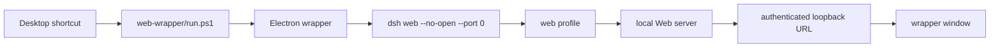
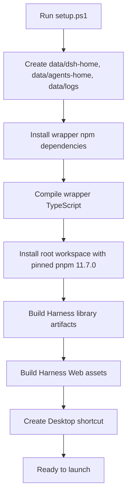
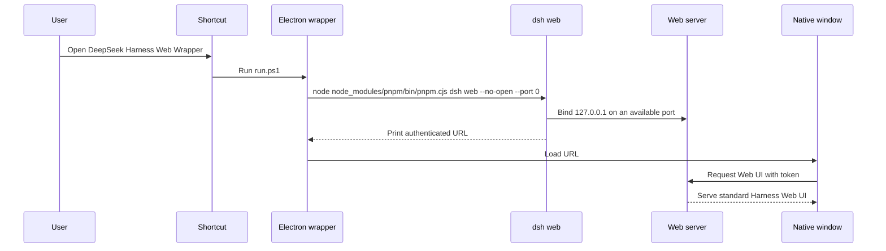

# DeepSeek Harness Web Wrapper

This folder contains a portable TypeScript Electron wrapper for the standard DeepSeek Harness Web UI. It does not modify the Harness Web app, the Cordis composition, or the desktop application. The wrapper starts the supported `dsh web` profile, keeps the Harness home beside the wrapper, waits for the authenticated local Web URL that Harness prints at startup, and opens that URL in a native window.

Run `setup.ps1` once from PowerShell. After setup, start the app from the desktop shortcut named `DeepSeek Harness Web Wrapper` or run `run.ps1` from this folder.

## Contents

- [What The Wrapper Does](#what-the-wrapper-does)
- [Runtime Requirements](#runtime-requirements)
- [Setup Flow](#setup-flow)
- [Launch Flow](#launch-flow)
- [Folder Layout](#folder-layout)
- [Data And Logs](#data-and-logs)
- [Moving The Wrapper](#moving-the-wrapper)
- [Troubleshooting](#troubleshooting)

## What The Wrapper Does

The wrapper is a small native shell around the existing Web UI. It launches the same `dsh web` profile that a browser launch uses, passes `--no-open` so Harness does not open the default browser, and reads the `dsh web: http://127.0.0.1:<port>/?token=...` line from the child process. The token URL stays local to this machine and is loaded into the wrapper window.

Electron is used here because this repository already builds and tests an Electron desktop shell. Reusing that runtime keeps the wrapper in the same JavaScript and TypeScript toolchain as the rest of the checkout and avoids adding Rust, Tauri, WebView2 packaging rules, or a second native build stack.



## Runtime Requirements

The wrapper depends on two sets of files: the wrapper's own Electron dependency and the Harness workspace artifacts that the Web profile serves.

| Requirement | Why it is needed | Prepared by |
| --- | --- | --- |
| Node.js compatible with the repository | Runs npm, pnpm, TypeScript, Electron, and the `dsh` source launcher. | User-installed Node.js |
| `web-wrapper/node_modules` | Provides Electron and TypeScript for the wrapper process. | `setup.ps1` runs `npm install` in `web-wrapper` |
| Root workspace `node_modules` | Provides pnpm, tsx, Vite, workspace packages, and the `dsh` launcher dependencies. | `setup.ps1` runs `npx pnpm@11.7.0 install` at the repository root |
| Built library artifacts | Generates package `lib/` outputs that the Web UI and profile resolution read. | `setup.ps1` runs `npx pnpm@11.7.0 run build:lib` |
| Built Web assets | Produces `apps/web/dist/index.html` and browser assets served by the Web profile. | `setup.ps1` runs `npx pnpm@11.7.0 run build:web` |
| Contained Harness home | Keeps profiles, settings, sessions, credentials, storage, and logs beside the wrapper instead of the user's normal Harness home. | The wrapper sets `DSH_HOME=web-wrapper/data/dsh-home` |
| Contained agents home | Keeps agent-side state beside the wrapper. | The wrapper sets `DSH_AGENTS_HOME=web-wrapper/data/agents-home` |

## Setup Flow

`setup.ps1` prepares the wrapper and the Harness checkout in a repeatable order. Run it again after moving the folder to another machine or another path so the shortcut points at the new location and dependencies match that machine.



Use these setup switches only when the corresponding work is already complete:

| Switch | Effect |
| --- | --- |
| `-SkipHarnessInstall` | Skips the root workspace dependency install. |
| `-SkipBuild` | Skips both `build:lib` and `build:web`. |

## Launch Flow

`run.ps1` starts Electron and mirrors wrapper output into `data/logs/wrapper-<timestamp>.log`. The Electron main process starts Harness through the repository-local pnpm entrypoint, so it does not depend on a global pnpm command or PowerShell command-shim quoting.



## Folder Layout

The wrapper assumes the repository folder moves as one unit. The source files are committed; generated dependencies, build output, runtime data, and logs stay local.

```text
deepseek-harness/
  apps/
  packages/
  node_modules/              generated by setup.ps1
  web-wrapper/
    README.md                this guide
    setup.ps1                install, build, and shortcut creation
    run.ps1                  launch script used by the shortcut
    loading.html             local loading page while Harness starts
    package.json             wrapper dependency manifest
    package-lock.json        wrapper dependency lockfile
    src/main.ts              Electron main process
    dist/                    generated wrapper JavaScript
    node_modules/            generated wrapper dependencies
    data/
      dsh-home/              contained Harness home
      agents-home/           contained agents home
      logs/                  wrapper and Harness logs
```

## Data And Logs

All wrapper-owned runtime files live under `web-wrapper/data`.

| Path | Contents |
| --- | --- |
| `data/dsh-home` | Harness profile files, settings, credentials, sessions, storage, and other `$DSH_HOME` state. |
| `data/agents-home` | Agent-side files that use `DSH_AGENTS_HOME`. |
| `data/logs/harness-*.log` | The child `dsh web` process output, including the authenticated URL line and startup errors. |
| `data/logs/wrapper-*.log` | Output captured by `run.ps1` when launched through the script or shortcut. |

The wrapper ignores `data/`, `dist/`, and `node_modules/` in Git. That keeps local sessions, credentials, logs, generated JavaScript, and installed dependencies out of commits.

## Moving The Wrapper

Move the whole `deepseek-harness` folder, not only `web-wrapper`. The wrapper needs the root workspace files because it launches the normal `dsh web` profile from this checkout.

After moving the folder:

1. Open PowerShell in `web-wrapper`.
2. Run `.\setup.ps1`.
3. Start from the recreated desktop shortcut.

The existing `web-wrapper/data` folder can move with the repository folder if you want to preserve local sessions and settings. Delete `web-wrapper/data` only when you intentionally want a fresh Harness home.

## Troubleshooting

If the wrapper shows `DeepSeek Harness did not start`, open the newest `data/logs/harness-*.log`. That file contains the `dsh web` startup output and usually names the missing dependency, failed build artifact, or command-launch problem.

Common recovery paths:

| Symptom | Likely cause | Recovery |
| --- | --- | --- |
| The log says the Web UI URL was never published. | `dsh web` exited before server readiness. | Run `.\setup.ps1` again, then retry. |
| The log mentions missing `apps/web/dist` or frontend assets. | Web assets were not built after install or after moving machines. | Run `.\setup.ps1` without `-SkipBuild`. |
| The log mentions missing package `lib/` files. | Library artifacts were not built. | Run `.\setup.ps1` without `-SkipBuild`. |
| The shortcut opens the old folder path. | The repository folder moved after shortcut creation. | Run `.\setup.ps1` from the new `web-wrapper` path. |
| Electron reports a JavaScript error before Harness logs appear. | Wrapper startup failed before or while creating the window. | Run `npm run build` in `web-wrapper`, then start with `.\run.ps1` so a wrapper log is written. |

The wrapper should not be used to edit the Harness Web UI. Change the Web UI in its existing app and package locations, rebuild the normal Harness artifacts, then use this wrapper to launch the result.
